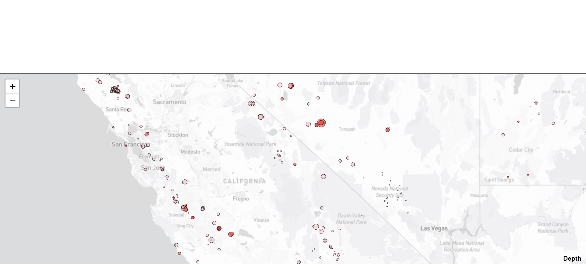

# Leaflet Challenge

## Background
The United States Geological Survey, or USGS for short, is dedicated to providing scientific data about natural hazards, ecosystems, environmental health, and the impacts of climate and land-use change. As part of their mission, they collect extensive earthquake data worldwide. In this challenge, you'll create a visualization tool to help the USGS effectively communicate this data to the public and other organizations.

## Deployment
Link: 

## Instructions
The instructions for this activity are divided into two parts:

* Part 1: Create the Earthquake Visualization

* Part 2: Gather and Plot More Data (Optional)

## Part 1: Create the Earthquake Visualization

Your initial task is to visualize an earthquake dataset. Follow these steps:

1. **Get your dataset:**
    * Visit the [USGS GeoJSON Feed](https://earthquake.usgs.gov/earthquakes/feed/v1.0/geojson.php) page.
    * Choose a dataset (e.g., "All Earthquakes from the Past 7 Days").
    * Use the provided JSON representation URL for visualization.
2. **API key for mapbox**
    * go to api.mapbox.com to get api key for your request.

3. **Import and visualize the data:**
    * Utilize Leaflet to create a map plotting earthquakes based on their latitude and longitude.
    * Reflect earthquake magnitude through marker size and earthquake depth through marker color.
    * Include popups for additional earthquake information.
    * Create a legend for context.

## Part 2: Gather and Plot More Data (Optional)

*This part is optional*
